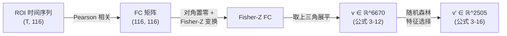
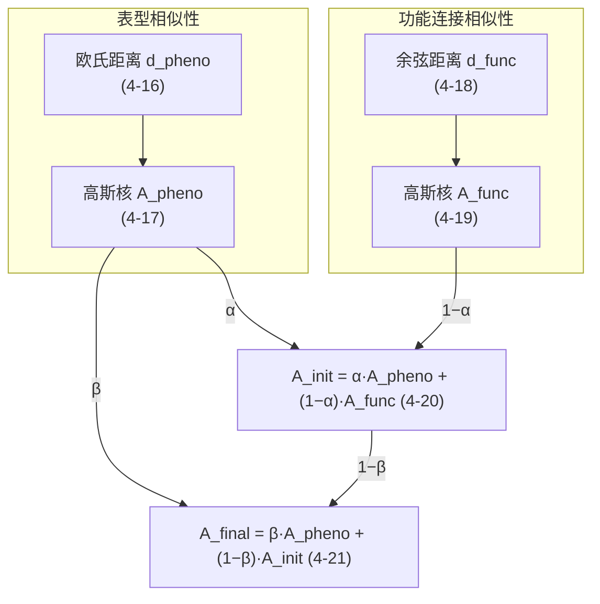
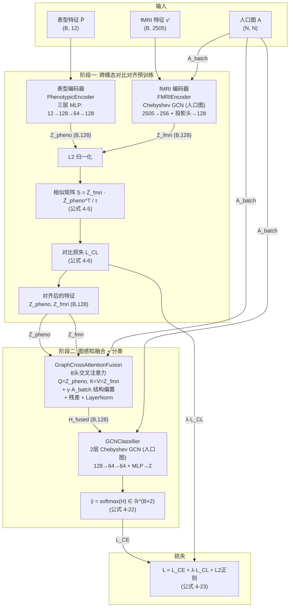
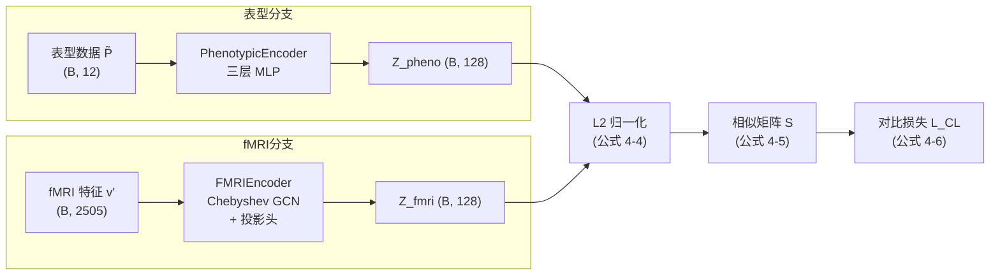
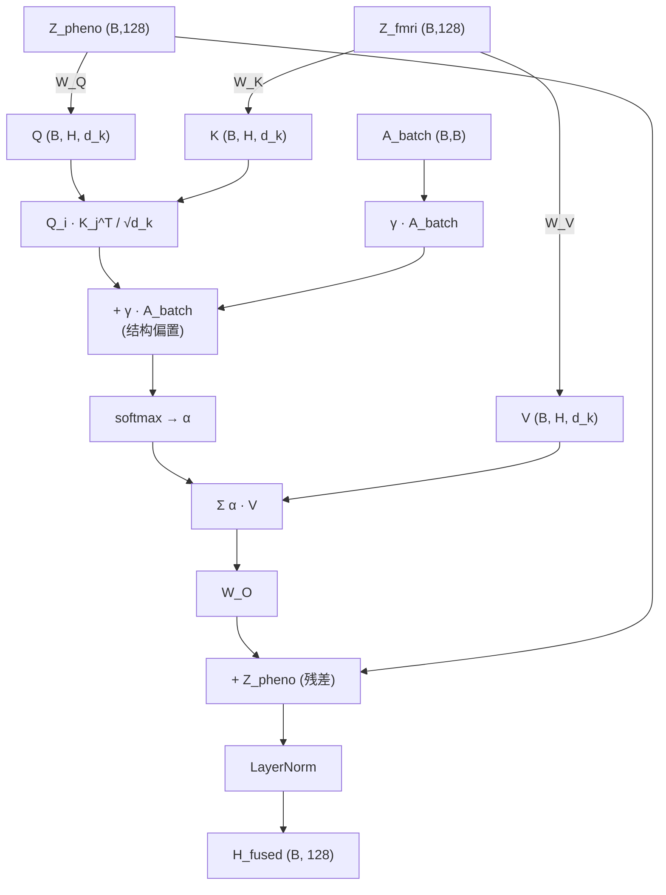
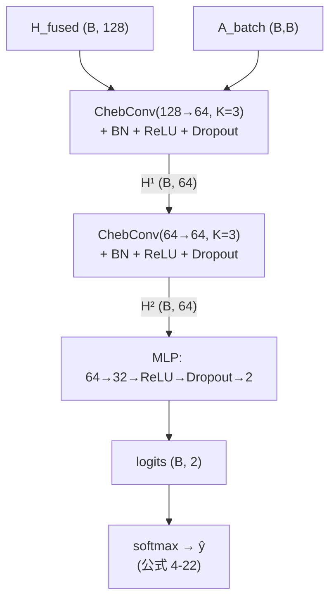
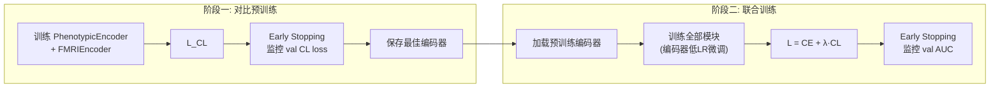

# AGENT-2.md — 项目技术路线与模型架构 (论文写作参考)

## 1. 项目概述

**课题:** 基于多模态深度学习融合的自闭症谱系障碍 (ASD) 早期诊断研究

**核心思路:** 两阶段训练流水线。阶段一通过跨模态对比学习 (NT-Xent) 将 fMRI 功能连接特征与临床表型特征对齐到统一 128 维潜空间; 阶段二将对齐后的特征结合人口图结构, 经图感知多头交叉注意力融合后送入双层 Chebyshev 图卷积网络完成 ASD/TD 二分类。总损失为交叉熵与对比损失的加权和。

**数据集:** ABIDE-I, N=871 (ASD=403, TD=468), 10 折分层交叉验证

---

## 2. 数据预处理

### 2.1 表型数据 $P \in \mathbb{R}^{N \times 12}$

12 维特征: ADOS (社交、刻板行为、总分), ADI-R (发病、重复行为、语言、社交), 智商 (VIQ, FIQ), 性别, 站点, 年龄。

**预处理:** KNN 填补 (k=5) → 全局 z-score 标准化

$$\tilde{P}_{im} = \frac{P_{im} - \mu_m}{\sigma_m}$$

### 2.2 fMRI 功能连接特征 $X \in \mathbb{R}^{N \times D}$, D=2505



**Fisher-Z 变换:**

$$X_{ij} = \text{arctanh}\left(\text{clip}(r_{ij},\ -0.9999,\ 0.9999)\right)$$

**上三角展平 (公式 3-12, 3-13):**

$$v = (v_1, v_2, \ldots, v_d), \quad d = \frac{N(N-1)}{2} = \frac{116 \times 115}{2} = 6670$$

**随机森林特征选择 (公式 3-14 ~ 3-16):**

使用 500 棵决策树训练随机森林, 按特征重要性 $I(v_i)$ 降序排列, 选取前 $f_{num} = 2505$ 个特征:

$$v' = (v_{i_1}, v_{i_2}, \ldots, v_{i_{f_{num}}}) \in \mathbb{R}^{f_{num}}, \quad I(v_{i_1}) \geq I(v_{i_2}) \geq \cdots \geq I(v_{i_{f_{num}}})$$

### 2.3 人口图 $A \in \mathbb{R}^{N \times N}$ (公式 4-16 ~ 4-21)

**每折独立构建**, 高斯核带宽 ($\sigma$) 仅从训练集样本计算, 防止验证集信息泄露。边权覆盖全部 N 个节点, 但图结构统计参数不受验证集污染。



$$d_{pheno}^{ij} = \sqrt{\sum_{m=1}^{M}(\tilde{P}_{im} - \tilde{P}_{jm})^2} \qquad (4\text{-}16)$$

$$A_{pheno}^{ij} = \exp\left(-\frac{(d_{pheno}^{ij})^2}{2\sigma_{pheno}^2}\right), \quad \sigma_{pheno} = \text{mean}(d_{pheno}) \qquad (4\text{-}17)$$

$$d_{func}^{ij} = 1 - \frac{X_i \cdot X_j}{\|X_i\|\|X_j\|} \qquad (4\text{-}18)$$

$$A_{func}^{ij} = \exp\left(-\frac{(d_{func}^{ij})^2}{2\sigma_{func}^2}\right), \quad \sigma_{func} = \text{mean}(d_{func}) \qquad (4\text{-}19)$$

$$A_{init} = \alpha \cdot A_{pheno} + (1-\alpha) \cdot A_{func} \qquad (4\text{-}20)$$

$$A_{final} = \beta \cdot A_{pheno} + (1-\beta) \cdot A_{init} \qquad (4\text{-}21)$$

默认 $\alpha = 0.9$, $\beta = 0.9$ (表型主导)。

---

## 3. 模型架构

### 3.1 总体流水线



### 3.2 阶段一: 跨模态对比对齐 (图 4-2)

**目标:** 将表型数据和 fMRI 数据映射到统一的 128 维潜空间, 使同一受试者的两模态表示尽可能接近。阶段一独立预训练, 仅优化对比损失。



#### 3.2.1 表型编码器 (PhenotypicEncoder, 公式 4-1)

| 层 | 操作 | 输入维度 | 输出维度 |
|----|------|----------|----------|
| 1 | Linear → BatchNorm → ReLU | 12 | 128 |
| 2 | Linear → BatchNorm → ReLU | 128 | 64 |
| 3 | Linear → ReLU | 64 | 128 |

$$Z_{pheno} = \text{ReLU}(W_2 \cdot \text{ReLU}(W_1 P + b_1) + b_2) \in \mathbb{R}^{N \times 128} \qquad (4\text{-}1)$$

#### 3.2.2 fMRI 编码器 (FMRIEncoder, 公式 4-2, 4-3)

受试者为节点, 降维后 FC 向量 ($D=2505$) 为节点特征, **人口图**为邻接矩阵。

**对称归一化:**

$$\hat{A} = \tilde{D}^{-1/2} \tilde{A} \tilde{D}^{-1/2}, \quad \tilde{A} = A + I_N$$

**Deep-GCN 隐藏层 (Chebyshev 图卷积, 公式 4-2):**

$$H^{(1)} = \text{ReLU}\left(\text{BN}\left(\sum_{k=0}^{K} T_k(\tilde{L}^{(0)}) \cdot X \cdot W_k^{(0)}\right)\right) \in \mathbb{R}^{N \times 256}$$

其中 $\tilde{L}^{(0)} = -\hat{A}$ 为重缩放拉普拉斯, Chebyshev 递推: $T_0=I$, $T_1=\tilde{L}$, $T_k=2\tilde{L}T_{k-1}-T_{k-2}$, $K=3$。

**投影头 (公式 4-3):**

$$Z_{fMRI} = \text{ReLU}(W_{proj} H^{(1)} + b_{proj}) \in \mathbb{R}^{N \times 128}$$

#### 3.2.3 对比损失 (公式 4-4 ~ 4-6)

**L2 归一化 (公式 4-4):**

$$\bar{Z}_{pheno} = \frac{Z_{pheno}}{\|Z_{pheno}\|_2}, \quad \bar{Z}_{fMRI} = \frac{Z_{fMRI}}{\|Z_{fMRI}\|_2}$$

**相似矩阵 (公式 4-5):**

$$S = \frac{\bar{Z}_{fMRI} \cdot \bar{Z}_{pheno}^T}{\tau}, \quad \tau = 0.3$$

**对比损失 (公式 4-6):**

$$\mathcal{L}_{contrast} = -\frac{1}{N}\sum_{i=1}^{N}\log\frac{\exp(S_{ii}/\tau)}{\sum_{j=1}^{N}\exp(S_{ij}/\tau)}$$

正样本: 同一受试者的表型与 fMRI 特征对 $(i, i)$; 负样本: batch 内所有其他受试者。

---

### 3.3 阶段二: 图感知交叉注意力融合 + GCN 分类

**目标:** 将对齐后的两模态特征结合人口图结构融合, 再用图卷积网络分类。阶段二使用 CE + λ·CL 联合损失, 编码器以低学习率微调。

#### 3.3.1 图感知多头交叉注意力融合 (GraphCrossAttentionFusion)

在标准多头注意力基础上引入人口图 $A_{batch}$ 作为结构偏置, 使注意力优先关注图上相似的受试者。



$$Q = Z_{pheno} W_Q, \quad K = Z_{fmri} W_K, \quad V = Z_{fmri} W_V$$

$$\text{Attn}_{h,ij} = \frac{Q_{h,i} \cdot K_{h,j}^{\top}}{\sqrt{d_k}} + \gamma \cdot A_{batch,ij}, \quad d_k = 128/8 = 16$$

$$\alpha_{h,ij} = \text{softmax}_j(\text{Attn}_{h,ij})$$

$$H_{fused} = \text{LayerNorm}\left(W_O \cdot \text{Concat}(\text{head}_1, \ldots, \text{head}_8) + Z_{pheno}\right) \in \mathbb{R}^{B \times 128}$$

$\gamma$ 为可学习标量 (初始值 1.0), 控制图结构偏置强度。残差连接保留表型信息。

#### 3.3.2 GCN 分类器 (GCNClassifier)

融合后的 $H_{fused}$ 在人口图上经 2 层 Chebyshev 图卷积提取高阶邻域特征, 再通过 MLP 输出分类概率。



**第一层 GCN:**

$$H^{(1)} = \text{Dropout}\left(\text{ReLU}\left(\text{BN}\left(\sum_{k=0}^{K} T_k(\hat{L}) \cdot H_{fused} \cdot W_k^{(1)}\right)\right)\right) \in \mathbb{R}^{B \times 64}$$

**第二层 GCN:**

$$H^{(2)} = \text{Dropout}\left(\text{ReLU}\left(\text{BN}\left(\sum_{k=0}^{K} T_k(\hat{L}) \cdot H^{(1)} \cdot W_k^{(2)}\right)\right)\right) \in \mathbb{R}^{B \times 64}$$

**MLP 分类头:**

$$\hat{y} = \text{softmax}(W_4 \cdot \text{ReLU}(W_3 \cdot H^{(2)})) \in \mathbb{R}^{B \times 2} \qquad (4\text{-}22)$$

---

### 3.4 损失函数 (公式 4-7, 4-23)

**阶段一损失 (仅对比对齐):**

$$\mathcal{L}_{Phase1} = \mathcal{L}_{contrast} \qquad (4\text{-}6)$$

**阶段二损失 (联合优化, 公式 4-7, 4-23):**

$$\mathcal{L} = \mathcal{L}_{CE} + \lambda_{contrast} \cdot \mathcal{L}_{contrast} + \lambda_{decay} \sum_l \|W^{(l)}\|_2^2 \qquad (4\text{-}23)$$

其中:

$$\mathcal{L}_{CE} = -\frac{1}{N}\sum_{i=1}^{N}\sum_{c=1}^{C} y_{ic}\log(\hat{y}_{ic}) \qquad (4\text{-}8)$$

| 损失项 | 默认值 | 实现方式 |
|--------|--------|---------|
| $\lambda_{contrast}$ | 0.5 | 显式加权 |
| $\lambda_{decay}$ | $5 \times 10^{-4}$ | Adam weight_decay |

**设计逻辑:** 阶段一先用对比损失预训练编码器使两模态特征对齐; 阶段二在对齐基础上联合 CE + CL 训练, CL 约束防止编码器在微调中偏离对齐状态。

---

## 4. Tensor Shape 全链路追踪

```
输入:
  fmri_flat       (B, 2505)       随机森林降维后的 FC 特征
  pheno           (B, 12)         z-score 标准化后的表型特征
  batch_indices   (B,)            全局索引, 用于 A_fold 子图切片

阶段一 — 编码与对齐:
  A_batch = A_fold[idx][:,idx]    (B, B)        人口图子图 (每折独立构建)
  Â = sym_normalize(A_batch)      (B, B)        对称归一化
  L̃ = -Â                         (B, B)        重缩放拉普拉斯

  [fMRI 编码器]
  H = Σ_k T_k(L̃)·X·W_k           (B, 256)      Chebyshev GCN (公式 4-2)
  H = ReLU(BN(H))                (B, 256)
  Z_fmri = ReLU(W_proj·H)        (B, 128)      投影头 (公式 4-3)

  [表型编码器]
  Z_pheno = MLP(pheno)            (B, 128)      三层 MLP (公式 4-1)

  [对比损失]
  Z̄_p, Z̄_f = L2_norm             (B, 128)      公式 4-4
  S = Z̄_f · Z̄_pᵀ / τ             (B, B)        公式 4-5
  L_CL = -mean(log(softmax(S)))  scalar        公式 4-6

阶段二 — 融合与分类:
  [图感知交叉注意力融合]
  Q = Z_pheno·W_Q                 (B, 8, 16)
  K = Z_fmri·W_K, V = Z_fmri·W_V (B, 8, 16)
  Attn = Q·Kᵀ/4 + γ·A_batch      (8, B, B)     含人口图偏置
  α = softmax(Attn)               (8, B, B)
  out = Σα·V → concat → W_O       (B, 128)
  H_fused = LN(out + Z_pheno)     (B, 128)

  [GCN 分类器]
  H¹ = ChebConv + BN+ReLU+Drop    (B, 64)       第一层 GCN
  H² = ChebConv + BN+ReLU+Drop    (B, 64)       第二层 GCN
  logits = MLP(H²)                (B, 2)        64→32→2
  ŷ = softmax(logits)             (B, 2)        公式 4-22

  [总损失]
  L = CE(ŷ, y) + λ·CL(Z̄_p, Z̄_f) + L2          公式 4-23, λ=0.5
```

---

## 5. 训练策略

### 5.1 两阶段训练流程



### 5.2 超参数配置

| 模块 | 参数 | 值 | 说明 |
|------|------|-----|------|
| **阶段一** | epochs | 50 | 对比预训练 |
| | lr | 2e-3 | 编码器学习率 |
| | τ (温度) | 0.3 | NT-Xent |
| | patience | 7 | 早停, 监控 val CL loss |
| **阶段二** | epochs | 150 | 联合训练 |
| | lr (Fusion + Classifier) | 1e-3 | 新模块学习率 |
| | lr (编码器) | 2e-4 | = lr × 0.2 |
| | $\lambda_{contrast}$ | 0.5 | CL 损失权重 |
| | patience | 20 | 早停, 监控 val AUC |
| **共享** | batch_size | 512 | |
| | weight_decay | 5e-4 | L2 正则 |
| | grad clip | 1.0 | max_norm |
| | CV | 10-fold | StratifiedKFold |
| | LR scheduler | ReduceLROnPlateau | factor=0.5, patience=5 |
| **人口图** | α, β | 0.9, 0.9 | 表型主导, 每折独立构建 |
| **FMRIEncoder** | in_dim | 2505 | 降维后 FC |
| | hidden_dim | 256 | GCN 隐藏层 |
| | out_dim | 128 | 投影维度 |
| | K | 3 | Chebyshev 阶数 |
| **PhenotypicEncoder** | 结构 | 12→128→64→128 | 三层 MLP + BatchNorm |
| **Fusion** | num_heads | 8 | |
| | embed_dim | 128 | |
| | dropout | 0.1 | |
| **GCNClassifier** | hidden_dim | 64 | |
| | K | 3 | Chebyshev 阶数 |
| | dropout | 0.2 | |
| | MLP | 64→32→2 | 分类头 |

---

## 6. 评估指标

每折验证集计算以下指标, 最终报告 10 折的 mean ± std:

| 指标 | 公式 | 说明 |
|------|------|------|
| ACC | $\frac{TP+TN}{TP+TN+FP+FN}$ | 总体准确率 |
| AUC | ROC 曲线下面积 | 基于连续概率, 不受阈值影响 |
| F1 | $\frac{2 \cdot Prec \cdot Rec}{Prec + Rec}$ | 精确率与召回率的调和平均 |
| Sensitivity | $\frac{TP}{TP+FN}$ | 灵敏度 (= Recall), ASD 检出率 |
| Specificity | $\frac{TN}{TN+FP}$ | 特异度, TD 正确排除率 |
| Precision | $\frac{TP}{TP+FP}$ | 精确率, 预测为 ASD 的正确率 |
| Recall | $\frac{TP}{TP+FN}$ | 召回率 (= Sensitivity) |

其中正类 (Positive) 为 ASD (label=1), 负类 (Negative) 为 TD (label=0)。

---

## 7. 文件结构

```
model-2.py             ← 模型定义 (Dataset + 编码器 + 融合 + GCN分类器)
train-2.py             ← 两阶段训练脚本 (10-Fold CV, 含日志与绘图)
train_parameter.py     ← 超参数搜索脚本 (随机采样 + 3-Fold 快速评估)
AGENT-2.md             ← 本文件 (论文写作参考)
logs/                  ← 训练日志与图像输出
  training_log.json    ← 完整训练日志 (每 epoch 每折)
  phase1_foldN.png     ← Phase 1 对比损失曲线
  phase3_foldN.png     ← Phase 3 训练曲线 (Loss/ACC+AUC/F1/Sen+Spe)
  fold_summary.png     ← 10 折汇总柱状图 + 折线图
logs_param_search/     ← 超参数搜索结果
  param_search_results.json
  top_configs_comparison.png
  param_impact.png
  best_config_radar.png
```

---

## 8. 与原始方案 (model.py) 的对比

| 方面 | model.py (原方案) | model-2.py (当前方案) |
|------|------------------|---------------------|
| fMRI 输入 | 116×116 FC 矩阵 | 降维后 2505 维向量 |
| fMRI 编码器 | 每人独立 ROI 图 GCN | 人口图上 Chebyshev GCN |
| 特征选择 | 无 | 随机森林 6670→2505 |
| 分类器 | HierarchicalAttentionGCN (4层+动态邻接+局部/全局注意力) | GCNClassifier (2层 GCN + MLP, 无注意力无动态邻接) |
| Phase 3 损失 | CE only | CE + λ·CL (联合) |
| 人口图构建 | 全局一次性 | 每折独立 (防泄露) |
| 训练稳定性 | 频繁坍塌 | 稳定收敛 |
